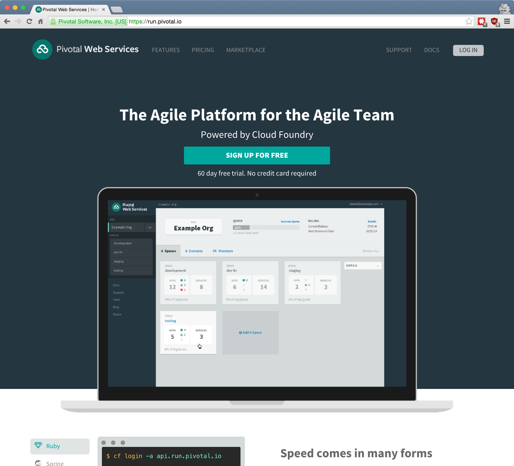
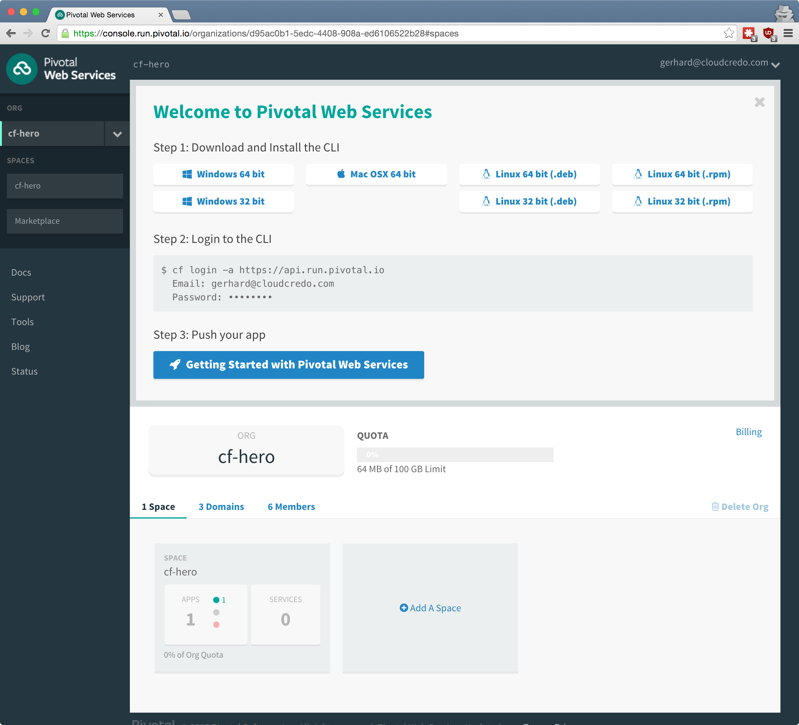

## Cloud Foundry <br />From Zero To Hero
### [01 What is Cloud Foundry?](#/0)

<p style="font-size: 50%; opacity: 0.2;">
  This content is copyright of CloudCredo. &copy; CloudCredo 2015. All rights reserved.
</p>

---

## [Why are we here?](#/1)

  1. To discover Cloud Foundry
  1. To learn by doing, as a team
  1. To become [Cloud Foundry Heroes](#/1)

---

## [You will learn:](#/2)

  1. What is Cloud Foundry?
  1. How do I interact with CF?
  1. How do I push my app into CF?
  1. What are app buildpacks?
  ---

  LUNCH BREAK

  ---
  1. How does CF make my app resilient?
  1. How do I debug my CF app?
  1. How is shared state handled in CF apps?
  1. How do I use custom domains &amp; routes?

---

## [If you really want to learn,](#/3) <br /> ask questions

> Questions cannot be stupid. Answers can.

---

## [We will deliver](#/4) a feature [<br />with](#/4) every topic

---

## [Why is the content being](#/5) delivered by a team [of people?](#/5)

---

## [Content on](#/6) USB flash drive

  * Slides for you to follow along
  * Example apps
  * Content from other training tracks

---

## [Online](#/7) slides

http://slides.cf-hero.cloudcredo.io

---

## [If you need an](#/8) extra challenge

### [Become a](#/8) CF Superhero

---

## [What is](#/9) Cloud Foundry[?](#/9)

  * An open _Platform as a Service_ (_PaaS_)
  * Fast and easy to build, test, deploy &amp; scale apps
  * Works with any* language or framework

> Find out more at [docs.cloudfoundry.org](https://docs.cloudfoundry.org/concepts/overview.html)

Note:
  Open-source with an Apache license, hosted on GitHub.

  Developers use the cf command line utility to interact with a CF deployment.
  The cf cli is pre-built for Windows, Mac and Linux.

  CF supports any language or framework through buildpacks. More on that subject later.

---

## [What is](#/10) Platform as a Service[?](#/10)

  * <span style="color: #8FF541;">Cloud Computing</span> characterised as **IaaS**, **PaaS**, and **SaaS**
  * Applications are the **PaaS** unit of currency
  * Heroku blazed a trail for **PaaS**

Note:
  IaaS - servers, SaaS - users.

  Heroku created patterns based on their experiences called "12 Factors" that have been heavily influencial. Also drove "buildpack" model

---

## [Why](#/11) Platform as a Service[?](#/11)

  * Deliver business value quickly
  * Focus on what matters for your business
  * Cheap &amp; fast to fail, promote learning

Note:
  Find what your customers actually want by showing them.
  Iterate constantly by learning what is actually important.

  Do not wait for IT to provision servers.

  Let developers choose the language and services that they believe are best for the job.

---

## [Cloud Foundry](#/12) Foundation

  * EMC
  * HP
  * IBM
  * Intel
  * Pivotal
  * SAP
  * Swisscom
  * VMware
  * ... 45 orgs and growing!


---

## [How many](#/13) types of CF[?](#/13)

  1. Open Source Software
  1. Vendored Distribution
  1. Private Service
  1. Public Service

---

## [1.](#/14) Open Source [Software](#/14)

  * [github.com/cloudfoundry](https://github.com/cloudfoundry)
  * **cf-release** requires [BOSH](https://bosh.io/docs) knowledge
  * **bosh-lite** for a local CF deployment

> Great learning opportunity

Note:
  Great learning opportunity through DIY.
  Takes a long time to master.
  BOSH has a steep learning curve.
  CF on bosh-lite requires 10GB of FREE RAM.
  Companies such as Cloud Credo specialise in custom CF deployments, optimisations & customisations.
  If you find yourself enjoying this type of work, we want to hear from you.

---

## [2.](#/15) Vendored [Distribution](#/15)

  * Pivotal Cloud Foundry
  * HP Helion Development Platform

Note:
  The Pivotal Cloud Foundry distribution is also known as Pivotal Elastic Runtime.
  Pivotal has been involved with CF the longest, they have the most experience.
  Pivotal is contributing the most to the open source CF.
  Pivotal has built &amp; open-sourced a number of stateful services such as MySQL, Cassandra, Redis, RabbitMQ and others.
  They all work great in combination with CF.

  HP Helion Development Platform is a Stackato Cloud Foundry Distribution.
  HP acquired Stackato in summer for 2015.

---

## [3.](#/16) Private [Service](#/16)

  * CloudCredo Platform
  * IBM Bluemix Dedicated
  * CenturyLink Private Cloud
  * Canopy Enterprise Private Cloud
  * HP Helion Development Platform

Note:
  CloudCredo Platform allows you to deploy a CF and a number of other services such as Kubernetes from a simple UI.
  You only pay the standard infrastructure costs, it's completely free to use.

  IBM Bluemix is CF and a limited number of services on IBM hardware. Banks love this.

  Hosted in CenturyLink DCs Worldwide.

  Canopy Cloud, a.k.a. The Atos Cloud.

  HP Helion Rack is Stackato CF setup on OpenStack running on HP hardware.

---

## [4.](#/17) Public [Service](#/17)

  * Anynines
  * Swisscom
  * IBM Bluemix
  * Pivotal Web Services

Note:
  Anynines is based in Saarbrücken and provides decent plans for all popular stateful services such as MongoDB, Redis, ElasticSearch &amp; MySQL.

  Swisscom Developer Portal, launched on the 2nd of October 2015, it's a 100% Swiss cloud solution according to the official website.

  IBM Bluemix runs on Softlayer in 2 regions: Texas &amp; London.
  Many IBM-only services such as Watson, Cloudant, Internet of Things are already integrated and come with generous free plans.
  You also get access to IBM Containers and Virtual Machines from the same dashboard.

  Pivotal Web Services have been around the longest, the service runs on AWS.

---

# [Feature](#/18)

```nohighlight
As a CF hero
I want to have a CF account
So that I don't have to worry about infrastructure ever again
```

---

https://run.pivotal.io

<a href="https://run.pivotal.io"></a>

---

<a href="https://console.run.pivotal.io"></a>

---

# <span style="color: #8FF541;">DELIVERED</span>

```nohighlight
As a CF hero
I want to have a CF account
So that I don't have to worry about infrastructure ever again
```

---

## [Any](#/22) questions?

> Questions cannot be stupid. Answers can.

---

# CF SUPERHERO

Compare CF public services:
  * [Anynines](http://www.anynines.com/pricing)
  * [Swisscom](https://developer.swisscom.com/pricing)
  * [IBM Bluemix](https://console.ng.bluemix.net/pricing/)
  * [Pivotal Web Services](https://run.pivotal.io/pricing)

Compare CF architectures:
  * [DEA v2](https://docs.cloudfoundry.org/concepts/architecture/)
  * [Diego v3](https://docs.cloudfoundry.org/concepts/diego/diego-architecture.html)

<p style="font-size: 50%; opacity: 0.2;">
  This content is copyright of CloudCredo. &copy; CloudCredo 2015. All rights reserved.
</p>
