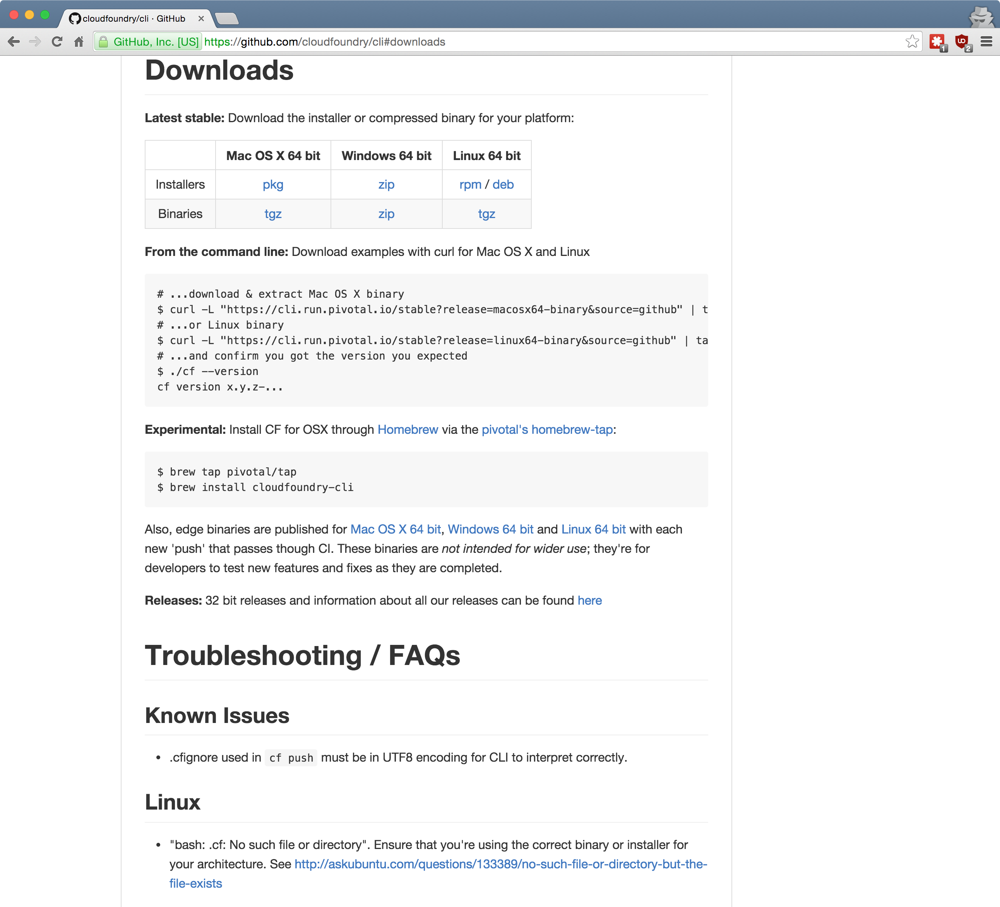

## Cloud Foundry <br />From Zero To Hero
### [02 How do I interact with CF?](#/0)

> Simon Jones

<p style="font-size: 50%; opacity: 0.2;">
  This content is copyright of CloudCredo. &copy; CloudCredo 2015. All rights reserved.
</p>

---

# [Feature](#/1)

```nohighlight
As a CF hero
I want to have a command line utility installed
So that I can deploy apps into my CF account
```

---

## [How do I interact with](#/2) CF[?](#/2)

### From Terminal, with CF CLI 

  * Use installer for your OS
  * 32/64 bit support
  * A single binary

Note:
  The CF CLI utility communicates with the Cloud Controller, a CF component, that exposes a RESTful API

  As all good things: from the terminal, using the CF CLI

  Popular IDEs come with plugins that allow you to deploy your app directly from the IDE

---

## [Install the](#/3) CF CLI

[github.com/cloudfoundry/cli](https://github.com/cloudfoundry/cli#downloads)




Note:
  The v6 of the CLI is written in Go and ships as a self-contained binary

  Using an installer is easier and you are more likely to end up with a correctly working utility. It's the recommended approach.

  On the GitHub page, you want to click on the links in the first column, Stable Installers.

---

## [Did](#/4) CF CLI [install correctly?](#/4)

```bash
$ cf
NAME:
   cf - A command line tool to interact with Cloud Foundry

USAGE:
   [environment variables] cf [global options] command [arguments...

VERSION:
   6.13.0-e68ce0f-2015-10-15T22:53:29+00:00

BUILD TIME:
   2015-10-25 01:04:16.22807612 +0100 BST
...
```

Note:
  To open the command prompt in Windows, press the Windows key (or Ctrl + R), type cmd and press Enter key.
  
  If you type just cf with no command or arguments you will get a very long list of all supported commands

  DO NOT TYPE THE $ SYMBOL

---

## [How do I log into](#/5) CF[?](#/5)

```bash
$ cf login -a api.run.pivotal.io -u YOUR-EMAIL-ADDRESS
```

```bash
$ cf help login
$ cf login -h
NAME:
   login - Log user in

USAGE:
   cf login [-a URL] [-u USERNAME] [-p PASSWORD] [-o ORG] [-s SPACE]
...
```

Note:
  We already know that cf displays a list of all supported commands

  cf help login (or any supported command) will display info about that specific command

  cf login -h behaves the same

  CF API endpoint & username from Pivotal CF

---

## [What is a](#/6) CF space[?](#/6)

Every application and service is scoped to a space

```bash
$ cf spaces

development
```

```bash
$ cf space development

development
    Org:               cf-hero
    Apps:              
    Domains:           
    Services:          
    Security Groups:   public_networks, dns, ssh-logging, p-mysql...
    Space Quota:
```

Note:

  Without a space, an application or service cannot be created

  A space provides a set of users access to a shared location for application development

  Each org must contain at least one space

  If an org contains a single space, that space will be automatically targeted

  If an org contains multiple spaces, a space needs to be explicitly selected

  Find info about your CF space

---

## [What is a](#/7) CF org[?](#/7)

Account shared by one or more users for resource <br />quotas, applications, services &amp; custom domains

```bash
$ cf orgs

name
cf-hero
```

```bash
$ cf org cf-hero

cf-hero:
    domains:        
    quota:          100GB:50free (102400M memory limit, Unlimited ..
    spaces:         cf-hero
    space quotas:
```

---

## [What are](#/8) resource quotas[?](#/8)


```bash
$ cf quotas

name           total mem   instance mem   routes   service instances
free           0           unlimited      1000     0                
trial          2G          unlimited      1000     10               
paid           10G         unlimited      1000     unlimited        
25GB           25G         unlimited      1000     unlimited        
50GB           50G         unlimited      1000     unlimited        
75GB           75G         unlimited      1000     unlimited        
100GB          100G        unlimited      1000     unlimited        
...
```

---

## [What is the relationship between](#/9) orgs, spaces &amp; apps[?](#/9)

```nohighlight

              . Org                   . cf-hero
              |                       |
              \-- Space               \-- cf-hero
                 |                       |
                 |-- App 1               |-- web-app
                 \-- App 2               \-- worker-app
.
```

---

## [Which org &amp; space am I currently](#/10) targeting[?](#/10)

```bash
$ cf target

API endpoint:   https://api.run.pivotal.io (API version: 2.36.0)
User:           simon@cloudcredo.com
Org:            cf-hero
Space:          cf-hero
```

---

## [How do I](#/11) target [a different <br />org and/or space?](#/11)

```bash
$ cf target -o ORG -s SPACE
```

Note:
  If you want an extra challenge, see the Superhero for using multiple targets

---

# <span style="color: #8FF541;">DELIVERED</span>

```nohighlight
As a CF hero
I want to have a command line utility installed
So that I can deploy apps into my CF account
```

---

## [Any](#/13) questions?

> Questions cannot be stupid. Answers can.

---

# CF SUPERHERO

  * Add the person next to you to your PWS org &amp; space
  * Create an account on [IBM Bluemix](https://console.ng.bluemix.net/registration/)
  * Use [Targets cf cli plugin](https://github.com/guidowb/cf-targets-plugin) with PWS &amp; Bluemix
  * Submit a localisation pull request to [cf cli](https://github.com/cloudfoundry/cli/blob/master/cf/i18n/README-i18n.md)

<p style="font-size: 50%; opacity: 0.2;">
  This content is copyright of CloudCredo. &copy; CloudCredo 2015. All rights reserved.
</p>
