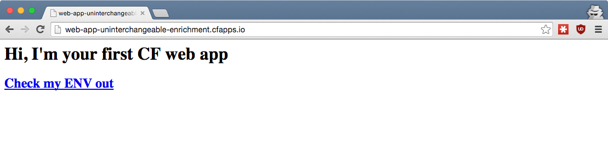

## Cloud Foundry <br />From Zero To Hero
### [03 How do I CF push my first app?](#/0)

> Gerhard Lazu

<p style="font-size: 50%; opacity: 0.2;">
  This content is copyright of CloudCredo. &copy; CloudCredo 2015. All rights reserved.
</p>

---

# [Feature](#/1)

```nohighlight
As a CF hero
I want my app to be accessible at a public URL
So that the whole world can see it
```

---

## [How do I](#/2) push [my app into CF?](#/2)

```bash
# From the training home directory:
$ cd 03-first-app/web
$ cf push

...

urls: web-app-uninterchangeable-enrichment.cfapps.io

...
```



Note:
  Now that we are logged in, let's push a sample app into CF

---

## [What](#/3) apps [are in the CF space?](#/3)

```bash
$ cf apps

name      state     instances   memory   disk   urls
web-app   started   1/1         32M      256M   web-app-uninterch...
```

---

## [I want to see](#/4) more app info

```bash
$ cf app web-app

requested state: started
instances: 1/1
usage: 32M x 1 instances
urls: web-app-uninterchangeable-enrichment.cfapps.io
last uploaded: Mon Nov 2 10:18:05 UTC 2015
stack: cflinuxfs2
buildpack: ruby 1.6.7

     state     since        cpu    memory         disk
#0   running   2015-11-02   0.0%   25.7M of 32M   95.1M of 256M
```

---

## [Where did the](#/5) app name &amp; quotas [come from?](#/5)

```bash
$ cat 03-first-app/web/manifest.yml

name: web-app
memory: 32M
disk_quota: 256M
random-route: true
buildpack: ruby_buildpack
```

---

## [What are the](#/6) <br />default app quotas[?](#/6)

  * Memory: **1G**
  * Disk: **1G**

---

## [What does ](#/7) random route [do?](#/7)

`cfapps.io` is shared by all CF [run.pivotal.io](https://run.pivotal.io/) apps

```bash
$ cf app web-app

...

urls: web-app-uninterchangeable-enrichment.cfapps.io

...
```

---

## [Where does the app](#/8) run[?](#/8)

```nohighlight
                           CONSUMER

                              |

                            ROUTER

                            /    \
                           /      \
                          /        \
                         /          \

                      HOST 1       HOST 2

                        |            |
      APP A INSTANCE 1 -|            |- APP A INSTANCE 2
      APP B INSTANCE 2 -|            |- APP B INSTANCE 1
```

Note:
  On an app host, also known as a DEA (CF v2) or a CELL (CF v3)

  The router sends traffic to the IP & port combination that match the Host header

  Multiple app instances means traffic gets randombly distributed

  Production Cloud Foundries use multiple routers for resiliency and many app hosts for a better app distribution

---

## [What happens when I](#/9) cf push[?](#/9)

1. App files sent to CF
1. Runnable app artefact is created (staging)
1. App starts on an app host

<hr />

Requests are sent to app (if a web app)

---

## 1. [App files sent to CF](#/10)

By the `cf` cli, no other dependency required

[`.cfignore`](https://docs.cloudfoundry.org/devguide/deploy-apps/prepare-to-deploy.html#exclude) (only send what is needed)

Note:
  cf cli sent all our app files to the Cloud Controller

  The Cloud Controller stores all files it receives in the Blob Store

  It also stores metadata about the app in the database

---

## 2. [Runnable](#/11) app artefact

App Files + Runtime Dependencies = App Artefact

Note:
  This is done by the Buildpack, part of the staging phase
  
  The majority of the output from a cf push is this staging phase

  Colin will tell us more about Buildpacks in the next topic 

---

## 3. App starts [on an app host](#/12)

If it's a web process, it binds to a TCP port

---

## Requests [are sent to app](#/13)

Randomly distributed across multiple app instances

---

## [How do I push a](#/14) worker app[?](#/14)

```bash
# From the training home directory:
$ cd 03-first-app/worker
$ cf push
```

```bash
$ cf app worker-app

requested state: started
instances: 1/1
usage: 16M x 1 instances
urls:
last uploaded: Mon Nov 2 13:56:39 UTC 2015
stack: cflinuxfs2
buildpack: binary_buildpack

     state     since        cpu    memory         disk
#0   running   2015-11-02   0.0%   10.7M of 16M   27.3M of 64M
```

---

## [How can I check what this](#/15) worker app [does?](#/15)

```bash
$ cf logs worker-app --recent

...
2015... [App/0] ERR + main
2015... [App/0] ERR + find_my_public_ip
2015... [App/0] ERR + which curl
2015... [App/0] ERR + curl -sL https://api.ipify.org?format=json
2015... [App/0] OUT {"ip":"54.236.219.204"}
2015... [App/0] ERR + suspend_myself
2015... [App/0] ERR + kill -STOP 11
```

  * Finds the public IP of the gateway host
  * Writes it to STDOUT
  * Suspends itself

---

# <span style="color: #8FF541;">DELIVERED</span>

```nohighlight
As a CF hero
I want my app to be accessible at a public URL
So that the whole world can see it
```

---

## Make room [for better apps](#/17)

```bash
$ cf delete worker-app
```

```bash
$ cf delete -f -r web-app
```

---

## [Any](#/18) questions?

> Questions cannot be stupid. Answers can.

---

# CF SUPERHERO

  * Debug `cf` commands with [`CF_TRACE=true`](https://docs.cloudfoundry.org/devguide/deploy-apps/troubleshoot-app-health.html#trace)
  * Create your own [`manifest.yml`](https://docs.cloudfoundry.org/devguide/deploy-apps/manifest.html)
  * Learn about [pushing WAR files](https://docs.cloudfoundry.org/buildpacks/java/java-tips.html)

<p style="font-size: 50%; opacity: 0.2;">
  This content is copyright of CloudCredo. &copy; CloudCredo 2015. All rights reserved.
</p>
