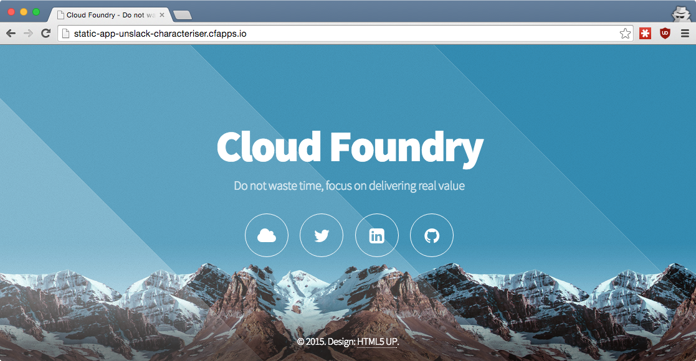

## Cloud Foundry <br />From Zero To Hero
### [04 What are buildpacks?](#/0)

<p style="font-size: 50%; opacity: 0.2;">
  This content is copyright of CloudCredo. &copy; CloudCredo 2015. All rights reserved.
</p>

---

# [Feature](#/1)

```nohighlight
As a CF hero
I want a simple static website
So that I can focus on building my product
```

---

## [What are ](#/2) buildpacks[?](#/2)

A Cloud Foundry component that <br />resolves your app's runtime dependencies

---

## [Why](#/3) buildpacks[?](#/3)

  * Simplify app deployment - focus on your code
  * Fewer files, quicker app deploys
  * Produce self-contained, runnable app artefacts

---

## [What does a](#/4) buildpack [do?](#/4)

  * Input is the application code
  * Examines application and fulfils dependencies
  * Output is a droplet
  * Metadata output defines ENV vars and start command

> Each buildpack participates in election

---

## [How does a](#/5) buildpack [work?](#/5)

  1. `bin/detect`
  1. `bin/compile`
  1. `bin/release`

---

## [Where does the](#/6) buildpack [run?](#/6)

  * Uses the host kernel with a rootfs (jeos)
  * Default rootfs is <span style="color: #8FF541;">cflinuxfs2</span> (based on Ubuntu 14.04 Trusty)
  * Buildpack execution and app runtime are in containers
  * Cloud Foundry uses [Garden](https://github.com/cloudfoundry-incubator/garden) for containerisation

---

## [Cloud Foundry](#/7) <br />deployment flow <br />[revisited](#/7)

  1. Developer pushes application
  1. Ordered list of buildpacks detect app compatibility
  1. <span style="color: #8FF541;">Winning</span> buildpack runs compile and release (staging)
  1. Resulting droplet is store in blobstore
  1. Droplets are deployed in containers for running apps

---

## [How many](#/8) types of buildpacks[?](#/8)

  1. Default buildpacks
  1. Community buildpacks
  1. Heroku buildpacks
  1. Custom buildpacks

> Online and Offline

---

## [1.](#/9) Default [buildpacks](#/9)

```bash
$ cf buildpacks

buildpack              position   filename
ruby_buildpack         1          ruby_buildpack-cached-v1.6.7
nodejs_buildpack       2          nodejs_buildpack-cached-v1.5.0
java_buildpack         3          java-buildpack-v3.2
go_buildpack           4          go_buildpack-cached-v1.6.2
liberty_buildpack      5          liberty_buildpack
python_buildpack       6          python_buildpack-cached-v1.5.1
php_buildpack          7          php_buildpack-cached-v4.1.4
staticfile_buildpack   8          staticfile_buildpack-cached-v1.2..
binary_buildpack       9          binary_buildpack-cached-v1.0.1
```

---

## [2.](#/10) Community [buildpacks](#/10)

[github.com/cloudfoundry-community](https://github.com/cloudfoundry-community/cf-docs-contrib/wiki/Buildpacks)

---

## [3.](#/11) Heroku [buildpacks](#/11)

  * CF buildpacks are based on them
  * They are interchangeable* (mostly)

---

## [4.](#/12) Custom [buildpacks](#/12)

  * Your own language deserves its own buildpack
  * As simple or as complicated as you want

---

## Static [buildpack](#/13)

```bash
# From the training home directory:
$ cd 04-buildpacks/static-app
$ cf push
```

```bash
$ cf app static-app

     state     since        cpu    memory        disk
#0   running   2015-11-02   0.0%   6.5M of 16M   33.6M of 64M
```



---

## Scale app [with ease](#/14)

```bash
$ cf scale static-app -i 32
```

```bash
$ cf app static-app

     state      since        cpu    memory        disk
#0   running    2015-11-02   0.0%   6.5M of 16M   33.6M of 64M
#1   starting   2015-11-02   0.0%   0 of  16M     0 of 64M
#2   running    2015-11-02   0.0%   6.9M of 16M   33.5M of 64M
...
#30   running   2015-11-02   0.0%   6.8M of 16M   33.5M of 64M
#31   running   2015-11-02   0.0%   7M of 16M     33.6M of 64M
```

---

# <span style="color: #8FF541;">DELIVERED</span>

```nohighlight
As a CF hero
I want a simple static website
So that I can focus on building my product
```

---

## [Any](#/16) questions?

> Questions cannot be stupid. Answers can.

---

# CF SUPERHERO

  * Write [custom buildpack](https://docs.cloudfoundry.org/buildpacks/custom.html) using [caddy HTTP/2 server](https://caddyserver.com/)
  * Deploy static-app with custom caddy buildpack

<p style="font-size: 50%; opacity: 0.2;">
  This content is copyright of CloudCredo. &copy; CloudCredo 2015. All rights reserved.
</p>
