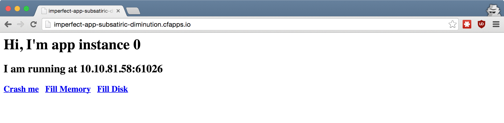
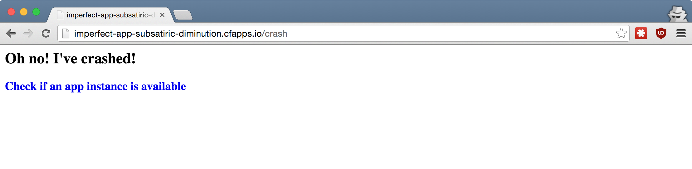
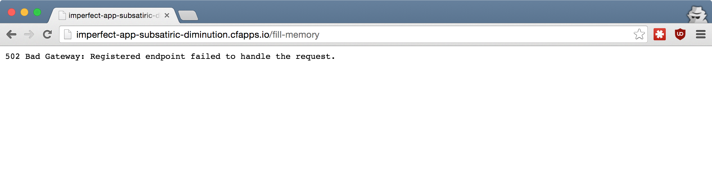
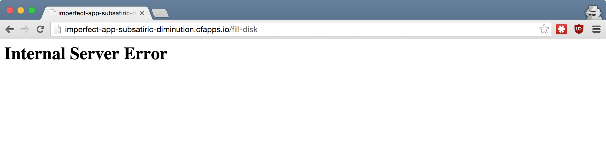

## Cloud Foundry <br />From Zero To Hero
### [05 How do I make my app resilient?](#/0)

<p style="font-size: 50%; opacity: 0.2;">
  This content is copyright of CloudCredo. &copy; CloudCredo 2015. All rights reserved.
</p>

---

# [Feature](#/1)

```nohighlight
As a CF hero
I want my app to be resilient
So that random failures won't take it offline
```

---

## [Let's](#/2) ship it

```bash
# From the training home directory:
$ cd 05-resilience/imperfect-app
$ cf push

...

urls: imperfect-app-votive-seeress.cfapps.io

...
```



---

## You've shipped [your new app!](#/3)

The static website is handling the traffic wonderfully

Everyone wants to use your new app, but...

---

## [It](#/4) crashes

> _Version 1 Sucks, But Ship It Anyway_




Note:
  [Coding Horror wisdom](http://blog.codinghorror.com/version-1-sucks-but-ship-it-anyway/)

---

## [How to](#/5) make an app resilient[?](#/5)

Embrace failure &amp; run many instances of the same app

```bash
$ cf scale imperfect-app -i 3
$ cf apps

name            state     instances   memory   disk   urls
imperfect-app   started   2/3         64M      256M   imperfect..
```

Note:
  Because CF is running your app, running many instances of it is just a command away

  Notice the different IPs that your app instances are running on...

  Even though each DEA runs on a different host, multiple app instances can end up on the same host

  The more app instances you have, the less likely that they will be running on the same host

  The next generation CF runtime - a.k.a. Diego - does a much better job in regards to evenly distributing the app instances

---

## [Many crashed instances,](#/6) <br />app still available

```bash
$ cf app imperfect-app

     state     since       cpu    memory         disk
#0   running   2015-11-02  0.0%   25.3M of 32M   66.9M of 128M
#1   down      2015-11-02  0.0%   0 of 0         0 of 0
#2   down      2015-11-02  0.0%   0 of 0         0 of 0
```

```bash
$ watch cf apps # Watch app instances restart in real-time
```


---

## [What](#/7) restarts crashed apps[?](#/7)

Health Manager in DEA v2 (a.k.a. [HM9K](https://docs.cloudfoundry.org/concepts/architecture/#hm9k))

Health Check in Diego v3

Note:
  When an app instance crashes, the Health Manager dubbed HM9K will notice this and restart the app instance

---

## [My app needs](#/8) more memory

```bash
$ cf events imperfect-app

description
index: 1, reason: CRASHED... Exited with status 255 (out of memory)
```

```bash
$ cf scale imperfect-app -m 256M
```



---

## [My app needs](#/9) more disk space

<span style="color: #FF4D4D;">Do not use the app's disk for persistence</span>

```bash
$ cf app imperfect-app

     state     since        cpu    memory           disk
#0   running   2015-11-02   0.0%   24.4M  of 256M   95.2M  of 256M
#1   running   2015-11-02   0.0%   112.4M of 256M   224.2M of 256M
#0   running   2015-11-02   0.0%   24.3M  of 256M   95.2M  of 256M
```

```bash
$ cf logs imperfect-app --recent

Errno::EDQUOT - Disk quota exceeded @ io_write - infinite-file:
```

```bash
$ cf scale imperfect-app -k 1G
```



Note:
  Use a service for persistence, do not store any files in the container that runs the app

---

## Scale [instances, disk & memory](#/10)

Combine multiple options in a single command

```bash
$ cf help scale

NAME:
   scale - Change or view the instance count, disk space limit...

USAGE:
   cf scale APP_NAME [-i INSTANCES] [-k DISK] [-m MEMORY] [-f]

OPTIONS:
   -i       Number of instances
   -k       Disk limit (e.g. 256M, 1024M, 1G)
   -m       Memory limit (e.g. 256M, 1024M, 1G)
   -f       Force restart of app without prompt
```

---

## [The](#/11) Twelve-Factor [App](#/11)

<a href="http://12factor.net"></a>

---

# <span style="color: #8FF541;">DELIVERED</span>

```nohighlight
As a CF hero
I want my app to be resilient
So that random failures won't take it offline
```

---

## [Any](#/13) questions?

> Questions cannot be stupid. Answers can.

---

# CF SUPERHERO

  * Read the [Twelve-Factor App](http://12factor.net/)
  * Benchmark app with [Load Impact](https://loadimpact.com/) (crash 1-2 instances)
  * Read about [Blue-Green deployment in CF](http://garage.mybluemix.net/posts/blue-green-deployment/)
  * Use [cf-blue-green-deploy](https://github.com/bluemixgaragelondon/cf-blue-green-deploy) cli plugin

<p style="font-size: 50%; opacity: 0.2;">
  This content is copyright of CloudCredo. &copy; CloudCredo 2015. All rights reserved.
</p>
