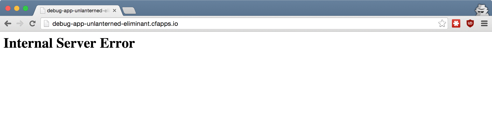
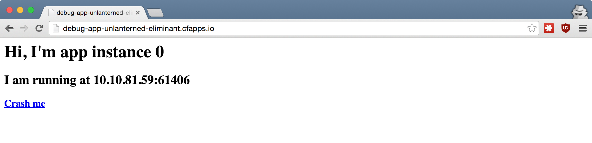
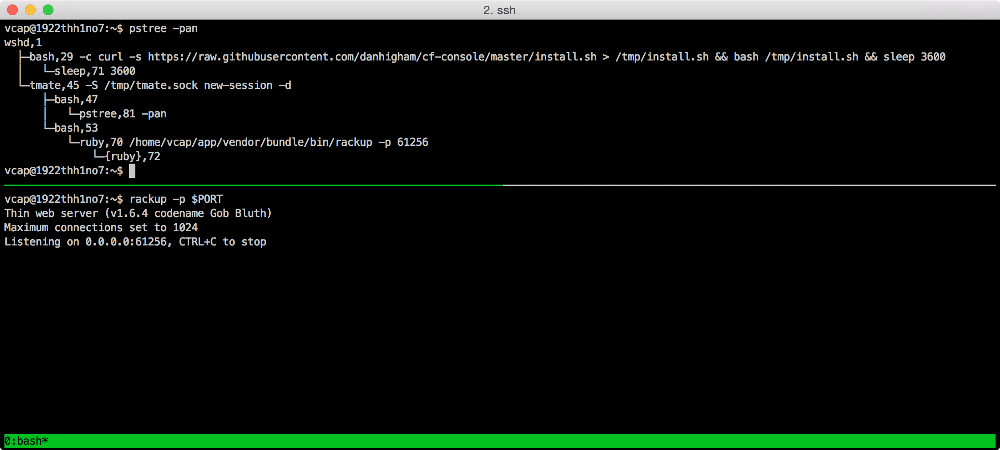

## Cloud Foundry for Beginners <br />From Zero To Hero
### [06 How do I debug my app?](#/0)

> Gerhard Lazu

<p style="font-size: 50%; opacity: 0.2;">
  This content is copyright of CloudCredo. &copy; CloudCredo 2015. All rights reserved.
</p>

---

# [Feature](#/1)

```nohighlight
As a CF hero
I want to know what my CF app is doing
So that I can debug it
```

---

## [Let's push a](#/2) 500 [app](#/2)

```bash
# From the training home directory:
$ cd 06-debugging/web
$ cf push

...

urls: debug-app-unlanterned-eliminant.cfapps.io

...
```



---

## [How do I](#/3) debug [my app?](#/3)

1. App logs
1. App events
1. SSH access
1. Buildpack support

---

## 1. [App](#/4) logs

```bash
$ cf logs debug-app --recent

...

... [App/0] ERR  ...  - RuntimeError - I am a bug, fix me:
... [App/0] ERR  /home/vcap/app/config.ru:9:in `block in <class:Web>
```

```bash
$ cf logs debug-app # TAILS APP LOGS, CTRL + C to exit
```

---

## [Let's](#/5) fix [the app](#/5)

```bash
$ cf set-env debug-app FIXED true
$ cf restart debug-app
```



> And now crash it!

---

## 2. [App](#/6) events

```bash
$ cf events debug-app

... description
... index: 0, reason: CRASHED, exit_description: app instance exit..
... state: STARTED
... state: STOPPED
...
```

> App will be automatically restarted, <br />no RESTARTED event is logged

Note:
  Notice that the most recent event is at the top

---

## 3. SSH [access](#/7)

Install the Console cf cli plugin

```bash
$ cf install-plugin -r CF-Community Console
$ cf console debug-app
$ cf logs debug-app --recent
...

# The last line in the log output has the SSH user & host
2015-11-02 [App/1] OUT RANDOM-USER@ln1.tmate.io
```

> Native SSH access in Diego

---

## 3. SSH [access](#/8)

```bash
$ ssh RANDOM-USER@ln1.tmate.io
$ pstree -pan
$ top # another favourite
```



```bash
# CTRL + B + D to exit
```

---

## 4. [Buildpack support](#/9)

* New Relic
* AppDynamics

> Best for Java apps

---

## New Relic [without <br />buildpack support](#/10)

Create a New Relic service instance

```bash
$ cf create-service newrelic standard newrelic
$ cf bind-service debug-app newrelic
$ cf env debug-app
# Find your New Relic license key
```

Provide app with New Relic license key

```bash
# From the training home directory:
$ cd 06-debugging/web
# Replace YOUR-LICENSE-KEY
$ vim newrelic.yml
```

```bash
$ cf push
```

Find New Relic Dashboard URL

```bash
$ cf service newrelic
```

---

# <span style="color: #8FF541;">DELIVERED</span>

```nohighlight
As a CF hero
I want to know what my CF app is doing
So that I can debug it
```
---

## [Any](#/11) questions?

> Questions cannot be stupid. Answers can.

---

# CF SUPERHERO

  * Setup [Skylight](https://www.skylight.io/) for app
  * Setup [Opbeat](https://opbeat.com/) for app
  * Learn about [CF Logging and Metrics](http://www.cfsummit.com/sites/cfs2015/files/pages/files/cfsummit15_king.pdf)
  * Send app logs to [Papertrail](https://papertrailapp.com/)

```bash
$ cf cups logdrain -l syslog://YOUR-PAPERTRAIL-LOG-DESTINATION
$ cf bind-service debug-app logdrain
# Check your Papertrail Events, no need to restart the app
```

<p style="font-size: 50%; opacity: 0.2;">
  This content is copyright of CloudCredo. &copy; CloudCredo 2015. All rights reserved.
</p>
