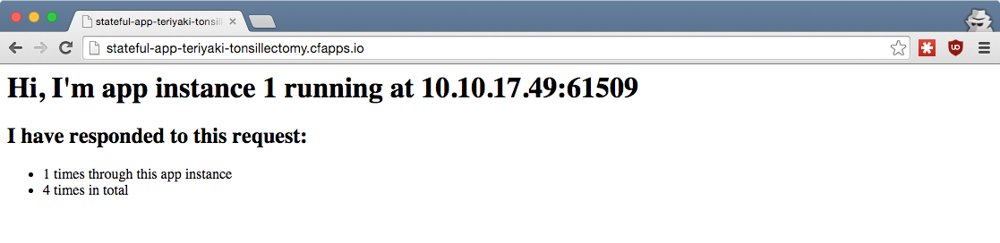
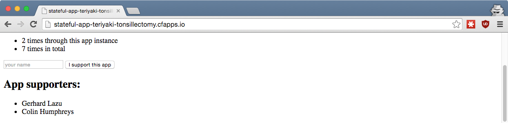

## Cloud Foundry <br />From Zero To Hero
### [07 Where does my app store state?](#/0)

<p style="font-size: 50%; opacity: 0.2;">
  This content is copyright of CloudCredo. &copy; CloudCredo 2015. All rights reserved.
</p>

---

# [Feature](#/1)

```nohighlight
As a CF hero
I want a new version of my app to show the same data
So that I can iterate on feedback from my users
```

---

## [Where does my app store](#/2) state[?](#/2)

In a service deployed alongside Cloud Foundry

Registered with CF through a [Service Broker](https://docs.cloudfoundry.org/services/overview.html)

---

## [What is a](#/3) Service Broker[?](#/3)

A service for provisioning resources of a specific type

An API advertising a catalog of service offerings and plans

Note:
  Service Broker API is registered and used by the Cloud Controller

---

## [How do I see all available](#/4) <br />service offerings[?](#/4)

```bash
$ cf marketplace
```

```bash
service          plans               description
____________________________________________________________________

cleardb          spark, boost*, ...  Highly available MySQL for y...
cloudamqp        lemur, tiger*, ...  Managed HA RabbitMQ servers ...
elephantsql      turtle, panda*, ..  PostgreSQL as a Service     ...
ironworker       large*,        ...  Scalable Background and Asyn...
loadimpact       lifree, li100*, ..  Automated and on-demand perf...
memcachedcloud   100mb*, 250mb*, ..  Enterprise-Class Memcached f...
mongolab         sandbox        ...  Fully-managed MongoDB-as-a-S...
newrelic         standard       ...  Manage and monitor your apps...
rediscloud       100mb*, 250mb*, ..  Enterprise-Class Redis for D...
searchly         small*, micro*, ..  Search Made Simple. Powered-...
sendgrid         free, bronze*,  ..  Email Delivery. Simplified.
....................................................................
```

---

## [I want a](#/5) Redis service instance

```bash
$ cf create-service rediscloud 30mb redis
```

```bash
$ cf services

name    service      plan   bound apps   last operation
redis   rediscloud   30mb                create succeeded
```

---

## [I want my app to](#/6) store state <br />in this Redis service instance

```bash
# From the training home directory:
$ cd 07-shared-state/stateful-app
$ cf push --no-start
```

```bash
$ cf bind-service stateful-app redis

App stateful-app is already bound to redis.
# Services can be defined in the app manifest
```

```bash
$ cf start stateful-app
```


Note:
  Service can also be bound from manifest.yml (& has been!) These services must be created first.

  Demo app, see redis connectivity by refreshing page & incrementing view count

---

## [Are](#/7) all app instances <br />using the same Redis[?](#/7)

```bash
$ cf scale stateful-app -i 2
```



---

## [How are](#/8) service details exposed to apps[?](#/8)

```bash
$ cf env stateful-app
...
 "VCAP_SERVICES": {
  "rediscloud": [
   {
    "credentials": {
     "hostname": "pub-redis-15708.us-east-1-4.6.ec2.redislabs.com",
     "password": "PASSWORD",
     "port": "15708"
    },
...
```

```
$ redis-cli -h pub-redis-15708...redislabs.com -p 15708 -a PASSWORD
pub-redis-15708.us-east-1-4.6.ec2.redislabs.com:15708> keys *
1) "9f397b68...total_instance_10.10.81.59:61500_responses"
2) "9f397b68...total_instance_10.10.17.49:61509_responses"
3) "9f397b68...total_app_responses"
```

```bash
pub-redis-15708.us-east-1-4.6.ec2.redislabs.com:15708> exit
```

---

## [Let's](#/9) iterate on user feedback

```bash
$ cf set-env stateful-app SHOW_APP_SUPPORTERS true
$ cf restart stateful-app
```



---

## App gets deleted [by mistake](#/10)

What actually happened: the CEO clicked some links.

```bash
$ cf delete -f -r stateful-app
```

We restore the app, much to our users' delight.

```
# From the training home directory:
$ cd 07-shared-state/stateful-app
$ cf push --no-start
$ cf set-env stateful-app SHOW_APP_SUPPORTERS true
$ cf start stateful-app
```


Note:
  The URL is different because we have pushed a new app

---

# <span style="color: #8FF541;">DELIVERED</span>

```
As a CF hero
I want a new version of my app to show the same data
So that I can iterate on feedback from my users
```

---

## [Any](#/12) questions?

> Questions cannot be stupid. Answers can.

---

# CF SUPERHERO

  * Use [SendGrid](https://sendgrid.com/) to send e-mails
  * Use [IronWorker](https://www.iron.io/worker/) for async tasks
  * Learn about [security groups](https://docs.cloudfoundry.org/adminguide/app-sec-groups.html)
  * Use a [manually created](https://docs.pivotal.io/pivotalcf/devguide/services/user-provided.html) IBM [Cloudant instance](https://cloudant.com/)

<p style="font-size: 50%; opacity: 0.2;">
  This content is copyright of CloudCredo. &copy; CloudCredo 2015. All rights reserved.
</p>
