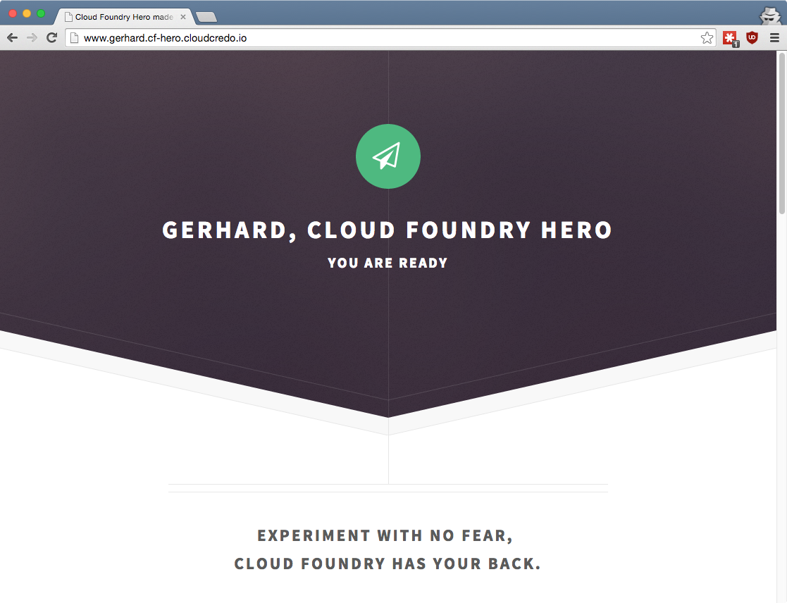
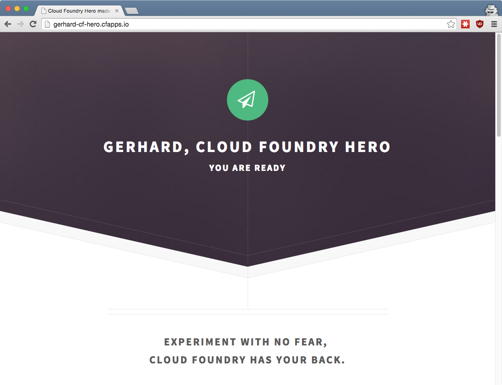
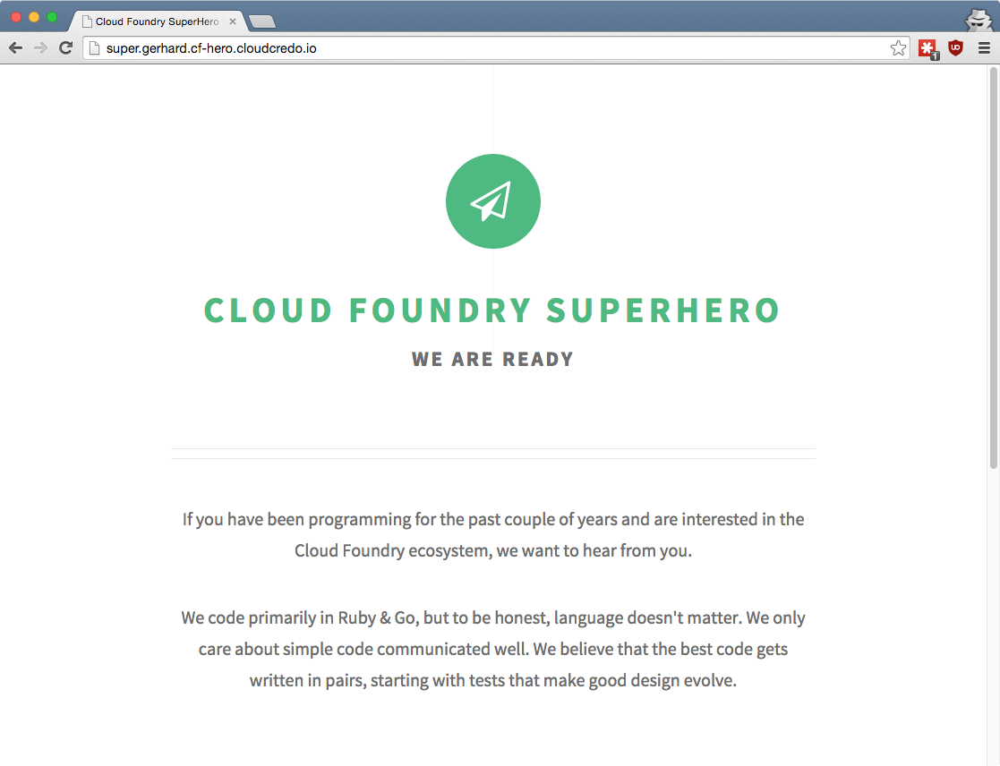

## Cloud Foundry <br />From Zero To Hero
### [08 How do I use custom domains?](#/0)

<p style="font-size: 50%; opacity: 0.2;">
  This content is copyright of CloudCredo. &copy; CloudCredo 2015. All rights reserved.
</p>

Note:
  Saving the best for last...

---

## [Cloud Foundry Hero](#/2) Badge

> Outstanding Cloud Foundry Knowledge

Note:
  But first...

---


# [Feature](#/2)

```nohighlight
As a CF hero
I want my app to be accessible at my domain
So that everyone can see my Cloud Foundry Hero Badge
```

---

## [How do I use](#/3) custom domains[?](#/3)

```bash
$ cf create-domain cf-hero-YOUR-NAME YOUR-NAME.cf-hero.cloudcredo.io
```

```bash
# From the training home directory:
$ cd 08-domains-routes/cf-hero
# Uncomment domain & replace YOUR-NAME
$ vim manifest.yml
```

```bash
$ cf push
```


Note:
  We can add our custom domain to our CF org.

---

## [I want](#/4) multiple routes <br />pointing to the same app

```bash
$ cf map-route cf-hero gerhard.cf-hero.cloudcredo.io -n www
```

```bash
$ cf apps

name     ..  urls
cf-hero  ..  gerhard.cf-hero.cloudcredo.io, www.gerhard.cloudcredo..
```



---

## [I also want](#/5) multiple domains <br />pointing to the same app

```bash
$ cf domains

name                            status
cfapps.io                       shared
gerhard.cf-hero.cloudcredo.io   owned
```

```bash
$ cf map-route cf-hero cfapps.io -n gerhard-cf-hero
```

```bash
$ cf routes

space         host              domain                          apps
development                     gerhard.cf-hero.cloudcredo.io   ...
development   www               gerhard.cf-hero.cloudcredo.io   ...
development   gerhard-cf-hero   cfapps.io                       ...
```



Note:
  Every Cloud Foundry installation will have at least one shared domain

  This is shared across all apps deployed on that Cloud Foundry

  Even though we are using no host with our custom domain, we cannot use no host with the shared domain

  Shared domains have reserved hosts, such as api

---

## [What about](#/6) multiple <br />domains &amp; routes[?](#/6)

```bash
$ cat imaginary-manifest.yml

name: cf-hero
domains:
  - cloudcredo.io
  - cloudcredo.com
hosts:
  - gerhard
  - gerhard-lazu
```

```bash
$ cf routes

space          host            domain            apps
development    gerhard         cloudcredo.io     cf-hero
development    gerhard-lazu    cloudcredo.io     cf-hero
development    gerhard         cloudcredo.com    cf-hero
development    gerhard-lazu    cloudcredo.com    cf-hero
```

---

## [Experiment with](#/7) app versions

```bash
$ cf push -f manifest-superhero.yml
```

And when it did its job...

```bash
$ cf delete -f -r cf-superhero
```



---

## [When you find](#/8) <br />the best app version

```bash
# From the training home directory:
$ cd 08-domains-routes/cf-hero-static
# Replace YOUR-NAME
$ vim public/index.html
# Uncomment domain & replace YOUR-NAME
$ vim manifest.yml
```

```bash
$ cf push
$ cf app cf-hero-static

     state     since        cpu    memory        disk
#0   running   2015-11-02   0.0%   6.8M of 16M   33.6M of 64M
...
#3   running   2015-11-02   0.0%   6.7M of 16M   33.5M of 64M
```

```bash
$ cf delete -f cf-hero
```

> Accidental blue/green deploy

---

## [You are now a](#/9) <br />Cloud Foundry Hero

<br />


---

# <span style="color: #8FF541;">DELIVERED</span>

```nohighlight
As a CF hero
I want my app to be accessible at my domain
So that everyone can see my Cloud Foundry Hero Badge
```

---

## [Any](#/11) questions?

> Questions cannot be stupid. Answers can.

---

# CF SUPERHERO

  * Set up a custom [SSL certificate](http://www.selfsignedcertificate.com/)
  * Use [feature flags](https://docs.cloudfoundry.org/adminguide/listing-feature-flags.html) instead of ENV vars
  * Delete all routes that are no longer used

```bash
$ cf delete-orphaned-routes
```

<p style="font-size: 50%; opacity: 0.2;">
  This content is copyright of CloudCredo. &copy; CloudCredo 2015. All rights reserved.
</p>
